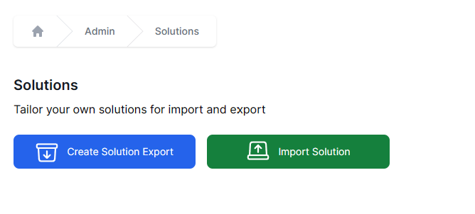
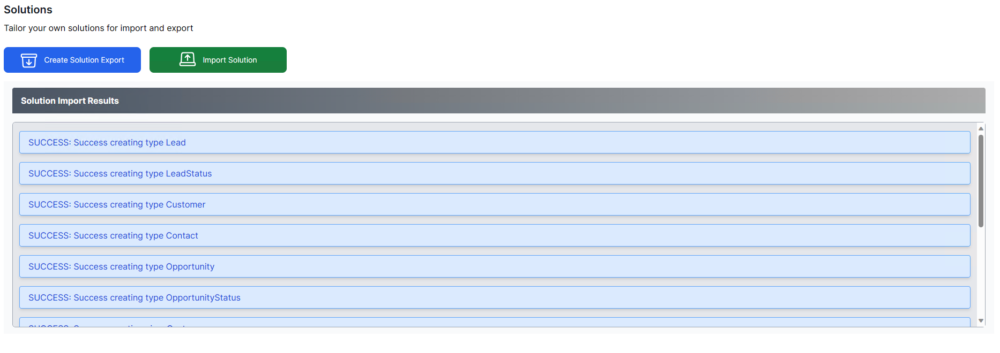

# Workflows CRM
Workflows CRM is a CRM System built on World of Workflows

Workflows CRM provides the following

- Lead Management
- Customer Management
- Contact Management
- Opportunity Management

The current version provides for automatic lead qualification.

# Getting Started

1. Install World of Workflows
2. Import the Solution
   1. Go to **Admin** -> **Solutions**
   
   2. Click **Import Solution**
   
   3. Choose the solution zip file
   
   4. Click **Confirm Import Solution**
   
   5. The solution will import successfully

# Working with Leads

A lead in a CRM (Customer Relationship Management) system refers to an individual or organisation that has shown an interest in your product, service, or company but has not yet been qualified as a potential customer. Essentially, a lead is a prospective customer or client who has the potential to be converted into a paying customer.

Key characteristics and aspects of a lead in a CRM system include:

1. **Source of Information**: A lead can come from various sources, including website inquiries, trade shows, direct emails, social media, referrals, or cold calling.
 
2. **Details**: In a CRM system, a lead will typically have associated details such as name, contact information (phone, email), company name, title, and possibly how they came into contact with your business (source).

3. **Stage**: Leads are usually at the initial stage of the sales process. They might have shown interest by signing up for a newsletter, downloading a piece of content, or making an inquiry, but they haven't been vetted or qualified.

4. **Qualification**: Over time, sales or marketing teams will engage with leads to determine their level of interest and whether they fit the company's buyer persona. Leads that meet certain criteria can be qualified and converted into sales opportunities or contacts in the CRM.

5. **Nurturing**: Not all leads immediately turn into customers. Many require nurturing, which involves maintaining consistent communication, sharing relevant content, and building a relationship over time to move them through the sales funnel.

6. **Tracking and Analysis**: In a CRM system, businesses can track interactions with leads, such as emails sent, phone calls made, and meetings scheduled. This data helps in analysing the effectiveness of sales and marketing strategies.

7. **Lead Scoring**: Some advanced CRM systems offer lead scoring, which assigns a value or score to leads based on various criteria, helping sales teams prioritise and focus their efforts on the most promising leads.

In summary, a lead in a CRM system represents a potential business opportunity. Proper management, tracking, and nurturing of leads through the CRM can greatly enhance the efficiency of the sales process and increase the chances of converting these leads into loyal customers.

To work with Leads, click **Leads** on the top menu.

Click  to add a new Lead.

**Guide to Completing the "Add an Instance" Form in a CRM**

1. **Title**: 
   - Enter an informative title for the lead such as "Workflows for ABC Company"

2. **First Name**:
   - Enter the first name of the lead in the provided text field.
   - Ensure you have spelt the name correctly and used the appropriate capitalisation.

3. **Last Name**:
   - Enter the surname or family name of the lead in the provided text field.
   - Again, ensure correct spelling and capitalisation.

4. **Email**:
   - Enter the lead's email address. 
   - Make sure it's in a valid email format (e.g., name@example.com).

5. **Phone**:
   - Enter the lead's phone number.
   - Include the country code if applicable. For example, for Australia, it would be +61 followed by the number.

6. **Est. amount**:
   - Enter an estimated amount that represents the potential value of this lead. This could be in terms of potential sales or any other metric used by your organisation.
   - Use numbers only, avoiding any currency symbols or commas. 

7. **Est. Close**:
   - Click on the calendar icon.
   - Select the estimated date by which you anticipate closing the deal with this lead. 
   - Note: This field uses the format 'mm/dd/yyyy'. If you're in Australia, remember that this format is different from the standard 'dd/mm/yyyy' format.

8. **Status**:
   - Click on the dropdown menu.
   - Choose the current status of the lead (e.g., New, In Progress, Closed).

9. **Company Name**:
   - Enter the name of the company the lead represents or is associated with. 
   - If the lead is an individual without a company affiliation, you can leave this blank or enter 'N/A'.

10. Once all fields are filled in:
   - Review the information for accuracy.
   - Click on the "Save" button to add the lead to the CRM.
   - If you decide not to add the lead or need to start over, click on the "Cancel" button to exit without saving.

Remember, always ensure that you have the lead's permission to store their details in your CRM, especially with regard to data protection regulations.

## Qualify a Lead

Workflows CRM includes an automated process to qualify a lead. This process:

1. Creates a Customer if required
2. Creates a contact if required
3. Creates an opportunity
4. Marks the lead as qualified

To Qualify a lead, click on the lead in the Lead Manageemnt area, click Workflows and choose Qualify.

Click the card to qualify the lead.

